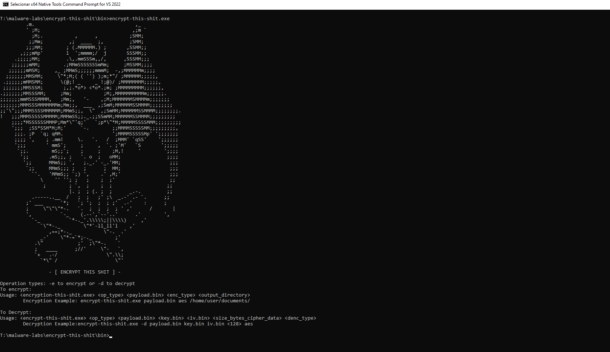

A simple command line tool to assist with encrypting/obfuscating your payload. 

How to use:

<code><encryption-this-shit.exe> <op_type> <payload.bin> <enc_type> <output_directory></code> 
<br>
<code>encription-this-shit.exe -d payload.bin aes C:\Users\Documents\pasta_teste</code>
<br>

O payload.bin deve ser um arquivo contendo os bytes brutos (raw bytes) do seu payload (Normalmente criado usando o HxD). Para garantir uma melhor segurança na criptografia, tanto a chave de 32 bytes quanto o IV (Vetor de Inicialização) de 16 bytes são gerados aleatoriamente.

<hr>

#### Funcionalidades atuais:

- Criptografia de Payload com AES-256 utilizando a Bcrypt da WinAPI
- Criptografia de Payload com RC4 através da SystemFunction032 da Advapi
- Salva todas as informações em uma pasta determinada por argv[4] (Key, IV e Payload para AES) e (Key e Payload se for RC4)

<hr>

#### Implementações Futuras:

- Ofuscação de Payload utilizando formatação IPV4/IPV6
- Fornecer funções de descriptografia para implementações em outras aplicações C

<hr>

Para compilar utilize exclusivamente o MSVC<br>
<code>cl.exe /utf-8 /Iinclude /Fo"bin\obj\\" /Fe"bin\encrypt-this-shit.exe" src\*.c</code>

Se possível, essa deve ser a estrutura do projeto na hora da compilação:<br>
```
├── bin/
    └── obj/
├── img/
└── include/
└── src/
```

O .exe será salvo dentro de bin/

<hr>

